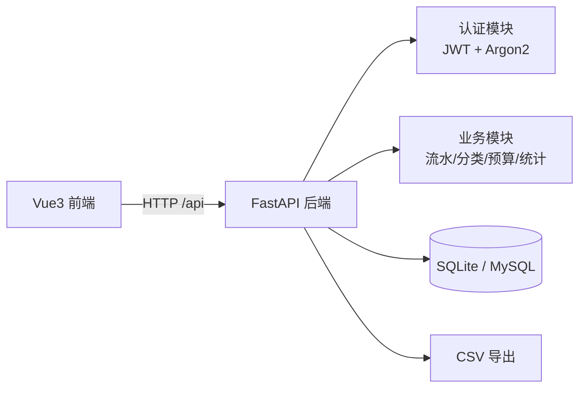

# 💰 MoneyMate 记账本

一个从 0 开发的 **Python 全栈记账系统**：收支记录、分类管理、月度预算、统计报表、CSV 导出，支持多用户注册登录，可 Docker 一键部署。

> 适合写在简历上的个人项目：技术栈主流、功能完整、可独立讲清每一行代码。

---

## ✨ 功能一览

| 模块 | 功能 |
|---|---|
| 账号 | 注册 / 登录 / JWT 令牌鉴权 / Argon2 密码加密 |
| 分类 | 注册自动创建 11 个默认分类，支持自定义、编辑、删除（有流水保护） |
| 流水 | 记一笔、编辑、删除、按月份/类型/分类/备注关键词筛选 |
| 预算 | 按月设置预算，实时显示已支出与超支提醒 |
| 统计 | 月度收支汇总、分类占比饼图、近 6 个月趋势折线图 |
| 导出 | 一键导出 CSV，方便用 Excel/代码做二次分析 |

## 🛠️ 技术栈

| 层 | 技术 |
|---|---|
| 后端 | Python 3.12 · FastAPI · SQLModel · Pydantic v2 |
| 认证 | JWT（PyJWT）+ Argon2（pwdlib） |
| 数据库 | SQLite（本地零配置，可换 MySQL） |
| 前端 | Vue 3 · TypeScript · Vite · Pinia · Element Plus · ECharts |
| 工程 | Docker（两阶段构建）· pytest（11 项测试）· Git |

## 🏗️ 系统架构



## 📁 目录结构

```
money-mate/
├── backend/
│   ├── app/
│   │   ├── main.py          # 入口：路由组装 + CORS + 静态托管
│   │   ├── config.py        # 环境变量配置
│   │   ├── database.py      # 数据库引擎与会话
│   │   ├── models.py        # 数据模型（User/Category/Transaction/Budget）
│   │   ├── schemas.py       # 请求/响应校验模型
│   │   ├── security.py      # 密码哈希 + JWT
│   │   ├── deps.py          # 依赖注入（当前用户）
│   │   └── routers/         # 接口：auth/categories/transactions/budget/stats
│   ├── requirements.txt
│   └── Dockerfile           # 两阶段构建（前端 + 后端）
├── frontend/
│   ├── src/
│   │   ├── views/           # 页面：登录/仪表盘/流水/预算/分类
│   │   ├── components/      # 布局 + ECharts 封装
│   │   ├── stores/          # Pinia 登录状态
│   │   ├── api.ts           # axios 封装（令牌注入 + 401 跳转）
│   │   └── router.ts        # 路由 + 登录守卫
│   ├── package.json
│   └── vite.config.ts       # 开发代理 /api -> 8000
├── tests/test_api.py        # 11 项接口测试
├── scripts/                 # 一键启动/构建脚本
├── docs/                    # 部署指南 / 简历写法 / 开发记录
└── docker-compose.yml
```

## 🚀 快速开始

### 方式一：一键脚本（推荐）

```bash
cd money-mate
./scripts/dev.sh        # 自动建虚拟环境 + 启动后端
```

打开 http://127.0.0.1:8000 使用页面，http://127.0.0.1:8000/docs 查看接口文档。

### 方式二：手动分步

```bash
# 1. 后端
python3 -m venv .venv
.venv/bin/pip install -r backend/requirements.txt
.venv/bin/python -m uvicorn app.main:app --port 8000 --app-dir backend

# 2. 前端（开发模式，自动代理 /api 到后端）
cd frontend
pnpm install
pnpm dev                # 打开 http://127.0.0.1:5173
```

## 🧪 测试

```bash
.venv/bin/python tests/test_api.py
# 预期：11 通过，0 失败
```

## 🌐 API 一览

| 方法 | 路径 | 说明 |
|---|---|---|
| POST | /api/auth/register | 注册（自动创建默认分类） |
| POST | /api/auth/login | 登录，返回 JWT |
| GET | /api/auth/me | 当前用户 |
| GET/POST | /api/categories | 分类列表 / 新建 |
| PUT/DELETE | /api/categories/{id} | 编辑 / 删除分类 |
| GET/POST | /api/transactions | 流水列表（可筛选）/ 记一笔 |
| PUT/DELETE | /api/transactions/{id} | 编辑 / 删除流水 |
| GET | /api/transactions/export | 导出 CSV |
| GET/PUT | /api/budget/{month} | 查询 / 设置月度预算 |
| GET | /api/stats/summary | 月度汇总 |
| GET | /api/stats/trend | 近 N 月趋势 |

## 📚 配套文档

- [部署指南](docs/部署指南.md)：Docker 部署 + 免费平台 + GitHub 上传
- [简历写法](docs/简历写法.md)：项目如何写进简历、面试怎么讲
- [开发记录](docs/开发记录.md)：开发过程与踩坑日记（面试素材）

## ⚠️ 说明

- 金额字段使用 `float` 便于教学演示；生产系统建议改用 `Decimal` 避免精度问题；
- `.env` 已被 Git 忽略，密钥不会上传；
- 默认 SQLite 零配置启动，`DATABASE_URL` 一行即可切换 MySQL。
