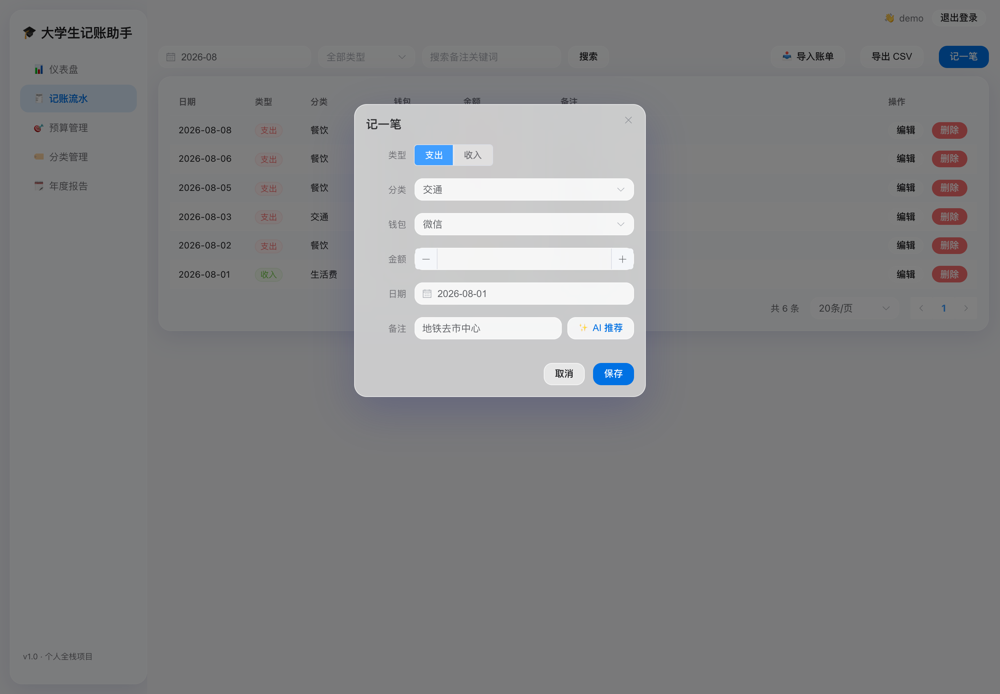
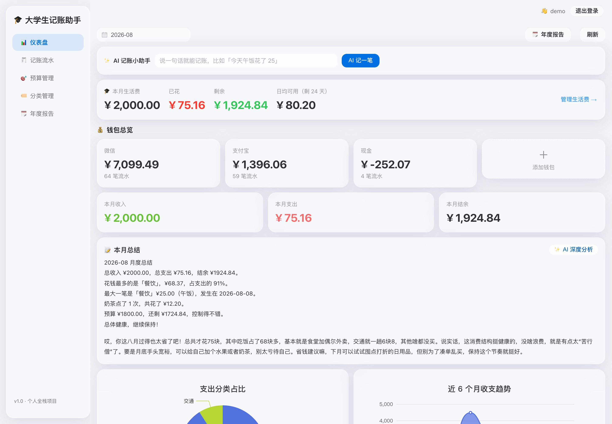

# 🎓 大学生记账助手

这是我第一个从头写到尾的 Python 全栈项目，专注**大学生记账场景**。

起因是生活费老是超支：月初的钱月底就没了，微信和支付宝里各有多少钱也搞不清。所以想自己写个记账网站——记下每笔钱花在哪、每个钱包还剩多少，**月底还能算算生活费还能撑几天**。顺便也把课堂上学的东西真正用一遍，练练手。


## 📚 书单（微信读书）

完整书单见 [书单.md](书单.md)，微信读书可搜，按本项目技术栈定制：

| 优先级 | 书名 | 为什么读 |
| --- | --- | --- |
| ★★★ | 《Python FastAPI Web开发从入门到项目实战》（刘瑜、安义、陈逸怀、喻小菲） | 与本项目技术栈完全对应（FastAPI + Vue.js 实战案例） |
| ★★★ | 《流畅的Python（第2版）》（[巴西]卢西亚诺·拉马略） | 异步 / Pydantic / 装饰器，FastAPI 底层与 Python 八股 |
| ★★★ | 《大模型应用开发》（鲍亮、李倩） | 提示词工程 / JSON 输出可靠性 / LLM 集成，对应 AI 记账解析 |
| ★★ | 《TypeScript实战指南》（胡栎铭） | Vue3 + TS 前端类型安全 |
| ★★ | 《深入浅出Docker》（[英]奈吉尔·波尔顿） | 镜像 / 容器 / 多阶段构建与部署 |
| ★★ | 《MySQL必知必会（第2版）》（[美]本·福达） | 数据库高频考点 |

## 📖 项目全解 & B 站自学路线

👉 [docs/项目全解与B站学习路线.md](docs/项目全解与B站学习路线.md)

包含：**每个目录/文件的作用介绍**、**技术栈总览**、**从零开始的 B 站学习顺序**（环境 → Python → 数据库 → 后端 → 前端 → 部署 → 面试理论）以及**面试要点速查表**。学习时对照项目文件看，知识才不会学完就忘。

## 在线体验

👉 [money-mate-8vby.onrender.com](https://money-mate-8vby.onrender.com)

免费部署在 Render 上（偶尔休眠唤醒需要几秒）。**演示账号：demo / demo123456**，登录就有近 4 个月的样例账单可以直接看图表。

## 页面截图





## 能做什么

- **注册登录**：注册完自动带一套常用分类（餐饮、交通、工资那些），不用自己配
- **生活费规划**：设置每月生活费金额和到账日，自动算「已花/剩余/日均可用/还能撑几天」
- **记一笔**：选分类、选钱包、填金额和备注
- **AI 记账小助手**：输入「今天午饭花了 25」，自动识别金额/分类/钱包，确认一下就能入账
- **AI 智能分类**：记账时填个备注，AI 自动推荐分类
- **AI 月度分析**：一句话总结这个月钱花在哪、给出省钱建议
- **多钱包**：微信、支付宝、现金分开记，余额自动帮你算
- **分页浏览**：流水再多也不卡，翻页加载
- **账单一键导入**：支持支付宝/微信导出的 CSV（自动识别列名、去重、分类自动匹配），也支持模板格式
- **分类管理**：默认 13 个学生场景分类（食堂/宿舍水电/学习/生活费/奖学金…），也能自己加、改、删
- **预算**：每月定个预算，花超了会提醒
- **统计图表**：仪表盘上有饼图（钱都花哪了）和近 6 个月收支趋势
- **本月总结**：月底来一段人话总结，比如「奶茶点了 3 次，共花了 45 块」
- **年度账单报告**：像支付宝年度账单那样，全年收支、每月趋势、分类排行、消费彩蛋
- **导出 CSV**：导出来用 Excel 自己再分析也行

## 用了什么技术

后端：Python 3.12 · FastAPI · SQLModel · JWT（Argon2 加密密码）· LLM 集成（DeepSeek，OpenAI 兼容可换供应商）

数据库：SQLite（本地开箱即用，`DATABASE_URL` 改一行就能换 MySQL）

缓存：统计接口带 Redis 缓存（没配 Redis 时自动用内存缓存）

前端：Vue 3 · TypeScript · Vite · Pinia · Element Plus · ECharts

工程：Docker · GitHub Actions（自动跑测试和构建）· pytest

## 目录长什么样

```
money-mate/
├── backend/
│   ├── app/
│   │   ├── main.py          # 入口，把路由组装起来
│   │   ├── models.py        # 四张表：用户/钱包/分类/流水 + 预算
│   │   ├── security.py      # 密码哈希 + JWT
│   │   ├── routers/         # 接口：登录/分类/钱包/流水/预算/统计
│   │   └── ...
│   ├── requirements.txt
│   └── Dockerfile
├── frontend/                # Vue3 前端
│   └── src/views/           # 登录/仪表盘/流水/预算/分类 五个页面
├── tests/test_api.py        # 13 项接口测试
├── scripts/                 # 一键启动脚本
├── docs/                    # 部署/简历/开发记录
└── docker-compose.yml
```

## 怎么跑起来

```bash
# 一键启动（会自动建虚拟环境装依赖）
./scripts/dev.sh
```

然后打开 http://127.0.0.1:8000 就能用，接口文档在 http://127.0.0.1:8000/docs。

或者用 Docker：

```bash
docker compose up --build
```

## 测试

```bash
.venv/bin/python tests/test_api.py
# 27 通过，0 失败（接口测试）

# 线上冒烟测试（服务运行中执行，部署后也能用）
.venv/bin/python tests/test_live.py
# 32 项检查全部通过
```

## 踩过的坑（都在 docs/开发记录.md 里）

新版 Starlette 测试要装 `httpx2`、TestClient 不进入 with 就不建表、pnpm 11 默认拦构建脚本、SQLite 里 `transaction` 是保留字要加引号……每一个都是查报错查出来的。

## 下一步计划

- [x] 补演示截图
- [x] 部署上线（Render 免费托管）
- [x] 演示数据自动初始化（空数据库启动时自动生成 demo 账号，测试环境除外）
- [ ] 想加「AA 分账」功能（和朋友吃饭算钱用）

## 说明

- 金额用了 `float`，教学图省事；真上线我会换成 `Decimal` 避免精度问题
- `.env` 不会传到 GitHub（已在忽略列表里）

## License

MIT
