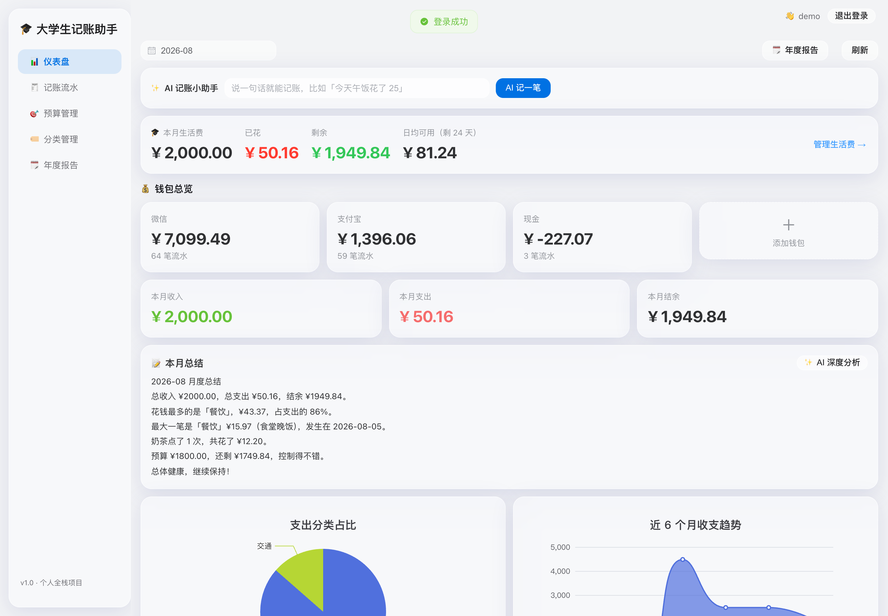
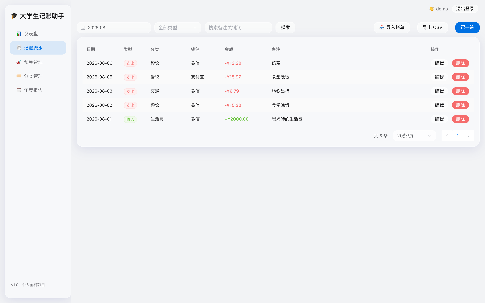
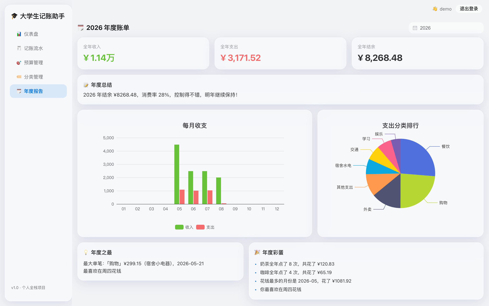

# 🎓 大学生记账助手

这是我第一个从头写到尾的 Python 全栈项目，专注**大学生记账场景**。

起因是生活费老是超支：月初的钱月底就没了，微信和支付宝里各有多少钱也搞不清。所以想自己写个记账网站——记下每笔钱花在哪、每个钱包还剩多少，**月底还能算算生活费还能撑几天**。顺便也把课堂上学的东西真正用一遍，练练手。


## 📺 B 站推荐（按技术栈 · 必看章节）

完整学习顺序（每阶段对照项目文件）见 [说明文档.md](说明文档.md) 第一部分。下面直接按本技术栈挑好的课 + 必看章节：

| 技术栈 | B 站课程（点击直达） | 必看章节 |
| --- | --- | --- |
| Python | [黑马程序员 Python 600 集（BV1ex411x7Em）](https://www.bilibili.com/video/BV1ex411x7Em) | 基础语法 → 列表/字典 → 函数 → 面向对象 → 异常处理 → 装饰器/生成器 |
| FastAPI | [2026 最新版 FastAPI 从入门到实战（BV1ufgY6MEHJ）](https://www.bilibili.com/video/BV1ufgY6MEHJ) | 路由与参数 → Pydantic 校验 → 依赖注入 → 文件上传 → ORM |
| MySQL | [黑马 MySQL 入门到精通（BV1Kr4y1i7ru）](https://www.bilibili.com/video/BV1Kr4y1i7ru) | 基础篇：SQL/约束/多表/事务；进阶篇：索引 B+树 |
| Redis | [黑马 Redis 入门到精通（BV1CJ411m7Gc）](https://www.bilibili.com/video/BV1CJ411m7Gc) | 数据类型与过期 → 缓存穿透/击穿/雪崩 |
| Vue3 | [尚硅谷 Vue2+Vue3 全套（BV1Zy4y1K7SH）](https://www.bilibili.com/video/BV1Zy4y1K7SH) | 直接跳 Vue3 部分：setup/ref/computed → 组件通信 → 路由守卫 |
| TypeScript | [尚硅谷 TypeScript（BV1Xy4y1v7S2）](https://www.bilibili.com/video/BV1Xy4y1v7S2) | 基础类型 → 接口/泛型 → 类型守卫 |
| Pinia | [Pinia 状态管理课程讲解 2024（BV1wx421S7xb）](https://www.bilibili.com/video/BV1wx421S7xb) | store/state/getters/actions；登录态持久化（`stores/auth.ts`） |
| Element Plus | [2025 Element Plus 从入门到精通（BV1q4hwzhEJp）](https://www.bilibili.com/video/BV1q4hwzhEJp) | 表单/表格/消息提示等常用组件 |
| ECharts | [ECharts 大屏可视化入门（BV1v7411R7mp）](https://www.bilibili.com/video/BV1v7411R7mp) | option 配置、柱状图/饼图（仪表盘用） |
| Axios | [尚硅谷 axios 入门与源码解析（BV1wr4y1K7tq）](https://www.bilibili.com/video/BV1wr4y1K7tq) | 请求/响应拦截器、token 注入、401 统一处理 |
| Vite | [Vite.js 快速入门到精通（BV13arYYxEGF）](https://www.bilibili.com/video/BV13arYYxEGF) | dev/build 区别、开发代理 |
| Docker | [狂神说 Docker 超详细版（BV1og4y1q7M4）](https://www.bilibili.com/video/BV1og4y1q7M4) | 核心概念 → 常用命令 → 数据卷 → Dockerfile |
| Git | [尚硅谷 Git 入门到精通（BV1vy4y1s7k6）](https://www.bilibili.com/video/BV1vy4y1s7k6) | 常用命令 → 分支 → 远程仓库/GitHub |
| Linux | [黑马 Linux 快速入门（BV1n84y1i7td）](https://www.bilibili.com/video/BV1n84y1i7td) | 常用命令、文件权限、进程（部署排障用） |
| 工程化 | [pytest 测试框架入门（BV18K411m7FH）](https://www.bilibili.com/video/BV18K411m7FH) + [GitHub Actions 从入门到专业人士（BV1dMCsBKEyk）](https://www.bilibili.com/video/BV1dMCsBKEyk) | fixture/断言；看懂 tests/ + .github/workflows/ci.yml + render.yaml |
| 八股补强 | [王道计网（BV19E411D78Q）](https://www.bilibili.com/video/BV19E411D78Q) + [王道操作系统（BV1YE411D7nH）](https://www.bilibili.com/video/BV1YE411D7nH) + [王道数据结构（BV1b7411N798）](https://www.bilibili.com/video/BV1b7411N798) + [尚硅谷 JS 高级（BV14s411E7qf）](https://www.bilibili.com/video/BV14s411E7qf) | 计网/OS/数据结构/JS 原理（投递前 2 周集中刷） |

## 📖 项目全解 & B 站自学路线

👉 [说明文档.md](说明文档.md)

包含：**每个目录/文件的作用介绍**、**技术栈总览**、**从零开始的 B 站学习顺序**（环境 → Python → 数据库 → 后端 → 前端 → 部署 → 面试理论）以及**面试要点速查表**；另外还有**部署指南 / 开发记录（踩坑）/ 简历写法 / 面试追问补充**。学习时对照项目文件看，知识才不会学完就忘。

## 在线体验

👉 [money-mate-8vby.onrender.com](https://money-mate-8vby.onrender.com)

免费部署在 Render 上（偶尔休眠唤醒需要几秒）。**演示账号：demo / demo123456**，登录就有近 4 个月的样例账单可以直接看图表。

## 页面截图







## 能做什么

- **注册登录**：注册完自动带一套常用分类（餐饮、交通、工资那些），不用自己配
- **生活费规划**：设置每月生活费金额和到账日，自动算「已花/剩余/日均可用/还能撑几天」
- **记一笔**：选分类、选钱包、填金额和备注
- **AI 记账小助手**：输入「今天午饭花了 25」，自动识别金额/分类/钱包，确认一下就能入账
- **AI 智能分类**：记账时填个备注，AI 自动推荐分类
- **AI 月度分析**：一句话总结这个月钱花在哪、给出省钱建议
- **多钱包**：微信、支付宝、现金分开记，余额自动帮你算
- **分页浏览**：流水再多也不卡，翻页加载
- **账单一键导入**：支持支付宝/微信导出的 CSV（自动识别列名、去重、分类自动匹配），也支持模板格式
- **分类管理**：默认 13 个学生场景分类（食堂/宿舍水电/学习/生活费/奖学金…），也能自己加、改、删
- **预算**：每月定个预算，花超了会提醒
- **统计图表**：仪表盘上有饼图（钱都花哪了）和近 6 个月收支趋势
- **本月总结**：月底来一段人话总结，比如「奶茶点了 3 次，共花了 45 块」
- **年度账单报告**：像支付宝年度账单那样，全年收支、每月趋势、分类排行、消费彩蛋
- **导出 CSV**：导出来用 Excel 自己再分析也行

## 用了什么技术

后端：Python 3.12 · FastAPI · SQLModel · JWT（Argon2 加密密码）· LLM 集成（DeepSeek，OpenAI 兼容可换供应商）

数据库：SQLite（本地开箱即用，`DATABASE_URL` 改一行就能换 MySQL）

缓存：统计接口带 Redis 缓存（没配 Redis 时自动用内存缓存）

前端：Vue 3 · TypeScript · Vite · Pinia · Element Plus · ECharts

工程：Docker · GitHub Actions（自动跑测试和构建）· pytest

## 目录长什么样

```
money-mate/
├── backend/
│   ├── app/
│   │   ├── main.py          # 入口，把路由组装起来
│   │   ├── models.py        # 四张表：用户/钱包/分类/流水 + 预算
│   │   ├── security.py      # 密码哈希 + JWT
│   │   ├── routers/         # 接口：登录/分类/钱包/流水/预算/统计
│   │   └── ...
│   ├── requirements.txt
│   └── Dockerfile
├── frontend/                # Vue3 前端
│   └── src/views/           # 登录/仪表盘/流水/预算/分类 五个页面
├── tests/test_api.py        # 27 项接口测试
├── scripts/                 # 一键启动脚本
├── 说明文档.md               # 全部技术说明（项目全解/部署/踩坑/简历/面试追问）
├── screenshots/             # 页面截图（README 用）
└── docker-compose.yml
```

## 📄 每个文件的作用

> `backend/` 下的 `__init__.py` 均为 Python 包标记；`frontend/src/vite-env.d.ts` 是 Vite 的 TypeScript 环境声明（标准文件）；`data/moneymate.db` 是运行数据库（gitignore 不提交），下面不再重复。

### 根目录

| 文件 | 作用 |
| --- | --- |
| `README.md` | 项目门面：功能、截图、技术栈、怎么跑 |
| `start.command` | macOS 双击一键启动：自动建虚拟环境、装依赖、起服务、开浏览器；检测到已在运行就直接打开 |
| `.env.example` | 环境变量示例（API Key / 数据库地址），复制为 `.env` 后填写 |
| `.env` | 本地密钥（已 gitignore，绝不上传 GitHub） |
| `.gitignore` | 忽略 `.venv`、`node_modules`、`*.db`、`.env`、构建产物等 |
| `.dockerignore` | 构建上下文排除项，避免把 node_modules / 本地数据打进镜像 |
| `LICENSE` | MIT 开源协议 |
| `Dockerfile` | 全栈多阶段构建：Node 构建前端 → Python 运行时托管前端，单端口跑全栈 |
| `docker-compose.yml` | 本地一键编排（后端 + MySQL 示例） |
| `render.yaml` | Render 云平台部署配置（线上 demo 用的就是它） |
| `.github/workflows/ci.yml` | GitHub Actions CI：后端测试 + 前端类型检查与构建，push/PR 自动触发 |

### `backend/` — FastAPI 后端

| 文件 | 作用 |
| --- | --- |
| `Dockerfile` | 后端独立镜像（生产用，也可单独跑） |
| `requirements.txt` | Python 依赖清单（FastAPI / SQLModel / Redis / JWT / argon2 / pytest…） |
| `app/main.py` | 入口：组装路由、CORS、生命周期（建表 + 演示数据）、托管前端静态文件 |
| `app/config.py` | 配置中心：所有密钥/地址从环境变量读，不硬编码 |
| `app/database.py` | 数据库引擎：SQLite/MySQL 切换、建表、跨线程兼容 |
| `app/models.py` | 数据模型：User / Wallet / Category / Transaction / Budget / Allowance |
| `app/schemas.py` | Pydantic 请求/响应模型：参数校验、返回结构 |
| `app/security.py` | 安全：Argon2 密码哈希 + JWT 签发/校验（HS256） |
| `app/deps.py` | FastAPI 依赖：OAuth2 取令牌 → 解析 → 返回当前用户 |
| `app/cache.py` | 缓存模块：Redis 优先、内存兜底，支持 JSON 序列化与 TTL |
| `app/rate_limit.py` | 固定窗口限流：60 秒内超限返回 429，保护 AI 接口 |
| `app/llm.py` | LLM 客户端：调 DeepSeek /chat/completions（JSON mode、流式、错误兜底） |
| `app/seed_demo.py` | 演示数据：首次启动注入 demo 账号和示例流水 |
| `app/routers/auth.py` | 注册、登录（OAuth2 密码模式）、获取当前用户 |
| `app/routers/wallets.py` | 钱包/账户增删改查，余额随流水自动累计 |
| `app/routers/categories.py` | 收支分类管理（餐饮/交通/宿舍水电…） |
| `app/routers/transactions.py` | 流水核心：增删改查、分页、搜索、CSV 导入（去重）/导出/模板 |
| `app/routers/budget.py` | 月度预算设置与当月支出对比 |
| `app/routers/allowances.py` | 生活费规划：到账日倒计时、剩余天数、日均可用 |
| `app/routers/stats.py` | 汇总/趋势/月度统计/年度报告（给 ECharts 供数） |
| `app/routers/ai.py` | AI 记账解析、AI 分类推荐、月度总结（带限流） |

### `frontend/` — Vue3 前端

| 文件 | 作用 |
| --- | --- |
| `package.json` | 依赖与脚本（dev / build / typecheck） |
| `pnpm-lock.yaml` / `pnpm-workspace.yaml` | 依赖锁定与 workspace 配置 |
| `index.html` | HTML 入口 |
| `vite.config.ts` | Vite 构建配置（代理 /api → 后端） |
| `tsconfig.json` / `tsconfig.node.json` | TypeScript 编译配置 |
| `src/main.ts` | 应用入口：挂载 Vue、Pinia、路由 |
| `src/App.vue` | 根组件 |
| `src/api.ts` | Axios 封装：baseURL、自动带令牌、401 自动跳登录 |
| `src/types.ts` | 与后端对应的 TS 类型（User / Category / Wallet / Transaction…） |
| `src/utils.ts` | 工具函数（金额格式化等） |
| `src/styles.css` | 全局样式 |
| `src/router.ts` | 路由表 + 登录守卫（没登录不能进业务页） |
| `src/stores/auth.ts` | Pinia 登录状态：token 持久化到 localStorage |
| `src/components/AppLayout.vue` | 后台布局：侧边导航 + 顶栏 + 内容区 |
| `src/components/EChart.vue` | ECharts 封装组件（传 option 即出图） |
| `src/views/LoginView.vue` | 登录 / 注册页 |
| `src/views/DashboardView.vue` | 仪表盘：本月收支、钱包、生活费倒计时、趋势图 |
| `src/views/TransactionsView.vue` | 流水页：增删改、分页搜索、CSV 导入导出 |
| `src/views/BudgetView.vue` | 预算页：设置月度预算、进度展示 |
| `src/views/CategoriesView.vue` | 分类管理页 |
| `src/views/AnnualReportView.vue` | 年度报告页 |

### `tests/`、`scripts/`、`screenshots/`

| 文件 | 作用 |
| --- | --- |
| `tests/test_api.py` | 27 项接口测试（pytest + TestClient，覆盖全业务） |
| `tests/test_live.py` | 线上冒烟脚本：对运行中的服务跑完整流程 |
| `scripts/dev.sh` | 一键启动后端（自动建虚拟环境） |
| `scripts/build-frontend.sh` | 构建前端并拷贝到 backend/app/static |
| `说明文档.md` | 全部技术说明三合一：项目全解（含 B 站学习路线）+ 部署指南 + 开发记录 + 简历写法 + 面试追问补充 |
| `screenshots/` | 页面截图（README 用） |

## 怎么跑起来

```bash
# 一键启动（会自动建虚拟环境装依赖）
./scripts/dev.sh
```

然后打开 http://127.0.0.1:8000 就能用，接口文档在 http://127.0.0.1:8000/docs。

或者用 Docker：

```bash
docker compose up --build
```

## 测试

```bash
.venv/bin/python tests/test_api.py
# 27 通过，0 失败（接口测试）

# 线上冒烟测试（服务运行中执行，部署后也能用）
.venv/bin/python tests/test_live.py
# 32 项检查全部通过
```

## 踩过的坑（都在 说明文档.md 第三部分「开发记录」里）

新版 Starlette 测试要装 `httpx2`、TestClient 不进入 with 就不建表、pnpm 11 默认拦构建脚本、SQLite 里 `transaction` 是保留字要加引号……每一个都是查报错查出来的。

## 下一步计划

- [x] 补演示截图
- [x] 部署上线（Render 免费托管）
- [x] 演示数据自动初始化（空数据库启动时自动生成 demo 账号，测试环境除外）
- [ ] 想加「AA 分账」功能（和朋友吃饭算钱用）

## 说明

- 金额已用 `Decimal` + `Numeric(10, 2)` 存储与计算（数据库层面精确到分），避免浮点精度问题
- `.env` 不会传到 GitHub（已在忽略列表里）

## License

MIT
